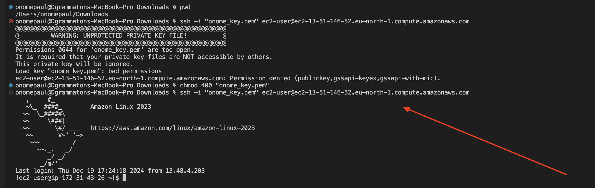

# MARKETPEAK_ECOMMERCE

In this project we will utilize Git for version control, developing the marketpeak platform (crispy kitchen) in a linux environment and also deploy it on an AWS EC2 instance, while adding new features, updates and fixing bugs, working on development branches and integrating all changes into the main barnch.

## What we will do in these project:

- **Proper use of git commands**
  - git init
  - git add
  - git commit
  - git push 
  - cloning of git repository
  - git branch
  - git merge
  - git pull
  
- **setting up an AWS EC2 instance**
  - connect to the instance using SSH
  - cloning the instance to linux server
  - imstalling of web servers on EC2
  - configuring httpd for website and accessing it from browser
  
- **Deploying the marketpeak platform while updates and bug fixes are properly carried out on the server**
  
### Git commands 

**Git init** command creates a new git repository, it converts an existing unversioned project into a git repository as it is usually the first command you will run in a new project asides the creating of directories.

The command `git init` 

**Git add** command stages changes to the working directory

The command `git add .` 

**Git commit** command saves the state (changes) of the project including all the tracked files while assigning a unique identifier.

The command `git commit -m` 

**Git push** command pushes the local content (repository) to a remote repository

The command `git push` 

## AWS DEPLOYMENT

I logged into my AWS management console using my created login details to create an EC2 instance and launch it using Amazon Linux AMI, also connected to the instance using the SSH method.

`instance launch` 

`connect via SSH`  

**Git Clone** command is used to point to and copy the full details of an existing repo to another location be it remote or local. It is been cloned to the SSh instance.

The command `git clone` 

**installing apache servers** is a free open source web-server that delivers web content over the internet. To install apache on systems we use yum package manager. 

**sudo** command is a command line utility that allows users to run command with elevated priviledges.

The command `sudo yum install httpd -y` 

**configuring apache for website** when apache (httpd) is installed on a linux system, it automatically creates a directory /var/www/html

The command `sudo rm -rf /var/www/html`  

The deployed Marketpeak_Ecommerce (crispy_kitchen) website can be accesed from our browsers remotely using the public ip of the EC2 instance

**Git branch** command can be used to create a new branch on git with a desired name.

The command `git branch`

**Git merge** command can be used to combine multiple sequence of commit into one unified history

The command `git commit` 

The command `git merge` 

**Git Pull** command is used to fetch and download content from a remote repository and immediately update the local repository to match that content

The command `git pull` 

